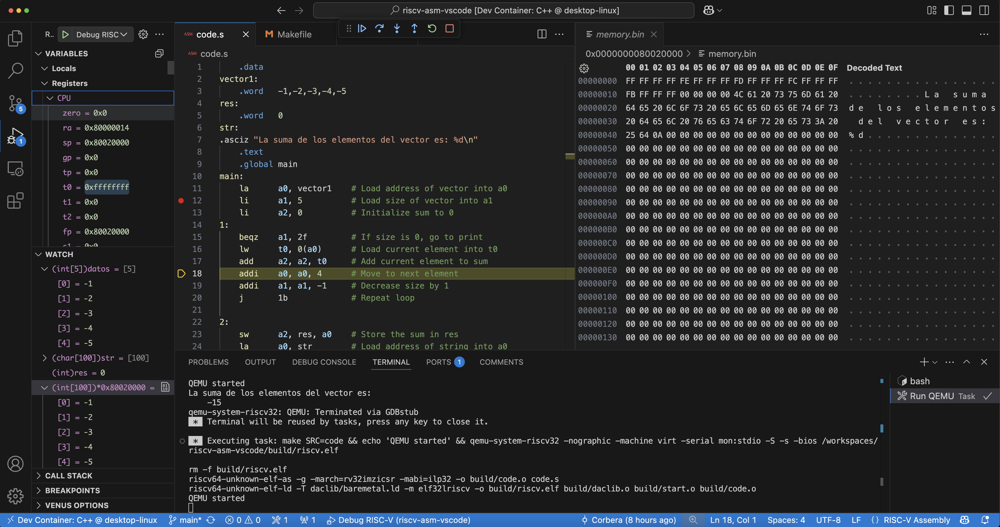

# Programar y depurar código ensamblador RISC-V en VSCode
Configuración de VSCode para poder programar y depurar código ensamblador RISC-V (basado en [este vídeo de Chuck's Tech Talk](https://www.youtube.com/watch?v=NbZDowmXzZs))

## Requisitos
- VSCode
- Extensión "Dev Containers" de VSCode
- Docker Desktop (Windows y Mac)

Utiliza un contenedor de desarrollo basado en Ubuntu 24.04, donde instala la toolchain RISC-V de GNU (riscv64-unknown-elf-gcc) y QEMU.

